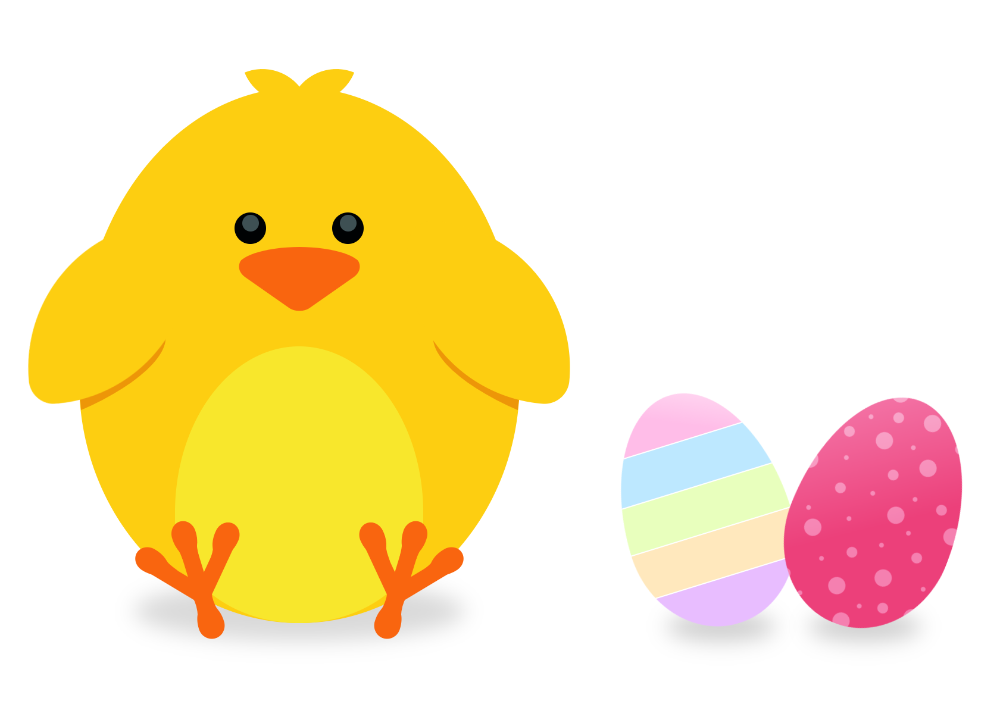

# Easter chicken & eggs - CSS drawings

My first CSS drawings. Inspired by [Flynerd's blog post and tutorial](https://www.flynerd.pl/2018/03/jak-stworzyc-jajka-pisanki-za-pomoca-html-css.html). These two eggs felt so sad being alone on a big white screen that I added a cute chicken (design's sadly not mine, I got it from [here](https://www.shutterstock.com/pl/image-vector/sweet-yellow-easter-chicken-sitting-waiting-359973989?src=4lVZThfeyc7k5zFdjliB_w-1-3)).

## Tools

- HTML
- Sass
- Webpack

## [Demo](https://karin-on.github.io/easter-eggs/)

## Preview

